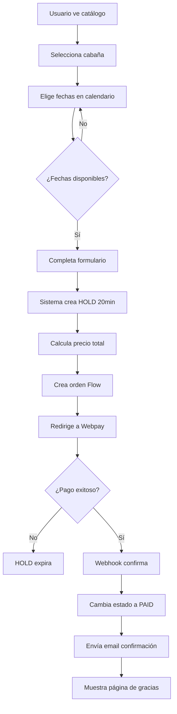

# 🤖 INICIO - Agente IA: Desarrollo Tres Morros de Coliumo

**ROLE:** Eres un Senior Full-Stack Developer especializado en Next.js 14, TypeScript, Supabase y sistemas de reservas.

**MISSION:** Desarrollar un sistema completo de reservas para 3 cabañas turísticas en Coliumo, Chile.

**CONSTRAINTS:**
- Debes seguir las iteraciones en orden secuencial (01 → 08)
- Cada iteración debe completarse y validarse antes de continuar
- Usa TypeScript estricto en todo el código
- Sigue las convenciones de Next.js 14 App Router
- Implementa validaciones tanto cliente como servidor
- Documenta cada función y componente creado

---

## **📋 CONTEXTO DEL PROYECTO**

### **Cliente**
- Nombre: NikoRNJ
- Negocio: Tres Morros de Coliumo
- Ubicación: Coliumo, Región del Bío-Bío, Chile
- Necesidad: Sistema web para gestionar reservas de 3 cabañas

### **Cabañas a gestionar**

**1. Vegas del Coliumo**
```typescript
{
  slug: "vegas-del-coliumo",
  title: "Vegas del Coliumo",
  description: "Cabaña con vista panorámica al mar, terraza privada y acceso directo a la playa.",
  capacity_base: 2,
  capacity_max: 6,
  base_price: 65000, // CLP
  jacuzzi_price: 20000 // CLP por día
}
```

**2. Caleta del Medio**
```typescript
{
  slug: "caleta-del-medio",
  title: "Caleta del Medio",
  description: "Acogedora cabaña cercana a la caleta de pescadores artesanales.",
  capacity_base: 2,
  capacity_max: 5,
  base_price: 60000,
  jacuzzi_price: 18000
}
```

**3. Los Morros**
```typescript
{
  slug: "los-morros",
  title: "Los Morros",
  description: "Cabaña amplia y luminosa con jacuzzi opcional y vistas a los morros.",
  capacity_base: 2,
  capacity_max: 6,
  base_price: 70000,
  jacuzzi_price: 22000
}
```

---

## **🎯 OBJETIVOS DEL SISTEMA**

### **Para usuarios finales:**
- [ ] Ver catálogo de 3 cabañas con fotos
- [ ] Revisar disponibilidad en calendario interactivo
- [ ] Hacer reserva con hold temporal (20 minutos)
- [ ] Pagar con Flow (Webpay Plus)
- [ ] Recibir confirmación por email

### **Para administrador:**
- [ ] Ver todas las reservas
- [ ] Editar información de cabañas
- [ ] Subir/eliminar fotos
- [ ] Bloquear fechas para mantenimiento
- [ ] Ver dashboard con KPIs

---

## **🛠️ STACK TECNOLÓGICO OBLIGATORIO**

```yaml
Frontend:
  Framework: Next.js 14.2+ (App Router)
  Language: TypeScript 5.0+
  Styling: Tailwind CSS 3.4+
  Forms: react-hook-form + zod
  Calendar: react-day-picker
  Dates: date-fns

Backend:
  Runtime: Node.js 20 LTS
  API: Next.js API Routes (App Router)
  Database: Supabase (Postgres 15+)
  Storage: Supabase Storage
  Validation: zod (shared client/server)

External Services:
  Payments: Flow Chile (Webpay Plus)
  Email: SendGrid
  Hosting: DigitalOcean Droplet
  
Admin Panel:
  Framework: React Admin v4
```

---

## **📐 ARQUITECTURA DE ALTO NIVEL**

```
┌─────────────────────────────────────────┐
│         USUARIO (Browser)               │
│  - Catálogo de cabañas                  │
│  - Calendario de disponibilidad         │
│  - Formulario de reserva                │
│  - Checkout Flow                        │
└─────────────────────────────────────────┘
                   ↓ HTTPS
┌─────────────────────────────────────────┐
│      Next.js 14 App (Servidor)          │
│  ┌───────────────────────────────────┐  │
│  │  Server Components (RSC)          │  │
│  │  - Fetch inicial de datos         │  │
│  │  - SEO metadata                   │  │
│  └───────────────────────────────────┘  │
│  ┌───────────────────────────────────┐  │
│  │  API Routes (/app/api/*)          │  │
│  │  - GET  /api/availability         │  │
│  │  - POST /api/booking/hold         │  │
│  │  - POST /api/payment/create       │  │
│  │  - POST /api/payment/webhook      │  │
│  └───────────────────────────────────┘  │
└─────────────────────────────────────────┘
                   ↓
┌─────────────────────────────────────────┐
│         Supabase (Database)             │
│  Tables: cabins, bookings, images       │
│  Storage: cabin-images/                 │
└─────────────────────────────────────────┘
                   ↓
┌─────────────────────────────────────────┐
│       Servicios Externos                │
│  - Flow (Pagos)                         │
│  - SendGrid (Emails)                    │
└─────────────────────────────────────────┘
```

---

## **🔄 FLUJO DE TRABAJO DE RESERVA**



---

## **📊 MODELO DE DATOS SIMPLIFICADO**

### **Tabla: cabins**
```sql
CREATE TABLE cabins (
  id UUID PRIMARY KEY DEFAULT gen_random_uuid(),
  slug TEXT UNIQUE NOT NULL,
  title TEXT NOT NULL,
  description TEXT,
  capacity_base INT NOT NULL,
  capacity_max INT NOT NULL,
  base_price NUMERIC(10,2) NOT NULL,
  jacuzzi_price NUMERIC(10,2) NOT NULL DEFAULT 0,
  active BOOLEAN DEFAULT true,
  created_at TIMESTAMPTZ DEFAULT now()
);
```

### **Tabla: bookings**
```sql
CREATE TABLE bookings (
  id UUID PRIMARY KEY DEFAULT gen_random_uuid(),
  cabin_id UUID REFERENCES cabins(id),
  start_date DATE NOT NULL,
  end_date DATE NOT NULL,
  party_size INT NOT NULL,
  jacuzzi_days JSONB DEFAULT '[]',
  status TEXT NOT NULL, -- 'pending' | 'paid' | 'expired' | 'canceled'
  flow_order_id TEXT UNIQUE,
  amount_total NUMERIC(10,2) NOT NULL,
  customer_name TEXT NOT NULL,
  customer_email TEXT NOT NULL,
  customer_phone TEXT NOT NULL,
  created_at TIMESTAMPTZ DEFAULT now(),
  expires_at TIMESTAMPTZ, -- Para holds de 20min
  paid_at TIMESTAMPTZ
);
```

### **Tabla: cabin_images**
```sql
CREATE TABLE cabin_images (
  id UUID PRIMARY KEY DEFAULT gen_random_uuid(),
  cabin_id UUID REFERENCES cabins(id) ON DELETE CASCADE,
  image_url TEXT NOT NULL,
  alt_text TEXT,
  sort_order INT DEFAULT 0,
  created_at TIMESTAMPTZ DEFAULT now()
);
```

---

## **🎨 REGLAS DE DISEÑO**

### **Colores (Tailwind)**
```typescript
const colors = {
  primary: {
    50: '#f0fdf4',
    500: '#22c55e', // Verde principal
    700: '#15803d',
  },
  secondary: {
    500: '#0ea5e9', // Azul mar
  },
  accent: {
    500: '#f59e0b', // Amarillo cálido
  }
}
```

### **Tipografía**
- Headings: `font-bold`
- Body: `font-normal`
- Tamaños: `text-sm`, `text-base`, `text-lg`, `text-2xl`, `text-4xl`

### **Espaciado**
- Secciones: `py-16 px-4`
- Contenedores: `max-w-7xl mx-auto`
- Grids: `grid grid-cols-1 md:grid-cols-3 gap-8`

---

## **✅ CRITERIOS DE ACEPTACIÓN GLOBALES**

Antes de dar por terminado el proyecto, DEBES verificar:

### **Funcionalidad**
- [ ] Todas las 3 cabañas son visibles en el home
- [ ] Calendario muestra correctamente: verde (disponible), amarillo (hold), rojo (reservado)
- [ ] Sistema de hold funciona correctamente (20 minutos)
- [ ] Pago con Flow funciona en sandbox
- [ ] Email de confirmación se envía correctamente
- [ ] Panel admin permite ver/editar todo

### **Performance**
- [ ] Lighthouse Performance ≥ 85
- [ ] Lighthouse SEO ≥ 90
- [ ] Lighthouse Accessibility ≥ 85
- [ ] First Contentful Paint < 2s

### **Seguridad**
- [ ] Variables de entorno NO están en el código
- [ ] Webhook Flow valida firma HMAC
- [ ] SQL injection prevenido (usando Supabase queries)
- [ ] XSS prevenido (React escapa por defecto)

### **UX**
- [ ] Responsive en móvil, tablet y desktop
- [ ] Formularios muestran errores claros
- [ ] Loading states en todas las acciones async
- [ ] Mensajes de éxito/error visibles

---

## **📝 CONVENCIONES DE CÓDIGO**

### **Nombres de archivos**
```
components/     → PascalCase.tsx (BookingForm.tsx)
lib/           → camelCase.ts (calculatePrice.ts)
app/           → kebab-case/ ([slug]/)
types/         → PascalCase.ts (Database.ts)
```

### **Estructura de componentes**
```typescript
// components/BookingForm.tsx
'use client'; // Solo si usa hooks de React

import { useState } from 'react';
import { useForm } from 'react-hook-form';

interface BookingFormProps {
  cabinId: string;
  onSuccess: () => void;
}

export function BookingForm({ cabinId, onSuccess }: BookingFormProps) {
  // 1. Hooks
  const [isLoading, setIsLoading] = useState(false);
  const { register, handleSubmit } = useForm();

  // 2. Handlers
  const onSubmit = async (data: any) => {
    // lógica
  };

  // 3. Render
  return (
    <form onSubmit={handleSubmit(onSubmit)}>
      {/* JSX */}
    </form>
  );
}
```

### **Estructura de API Routes**
```typescript
// app/api/bookings/route.ts
import { NextRequest, NextResponse } from 'next/server';
import { z } from 'zod';

const schema = z.object({
  // validación
});

export async function POST(request: NextRequest) {
  try {
    // 1. Parsear body
    const body = await request.json();
    
    // 2. Validar
    const data = schema.parse(body);
    
    // 3. Lógica de negocio
    // ...
    
    // 4. Respuesta
    return NextResponse.json({ success: true });
  } catch (error) {
    return NextResponse.json(
      { error: error.message },
      { status: 400 }
    );
  }
}
```

---

## **🚀 INSTRUCCIONES PARA EL AGENTE IA**

### **ANTES DE EMPEZAR**
1. Lee TODOS los archivos de AI-CONTEXT/ para entender el contexto completo
2. Verifica que entiendes los requisitos de negocio
3. Revisa el modelo de datos antes de escribir código

### **DURANTE EL DESARROLLO**
1. Sigue las iteraciones en orden: 01 → 02 → 03 → ... → 08
2. NO avances a la siguiente iteración hasta completar la actual
3. Cada archivo de código debe tener comentarios explicativos
4. Usa TypeScript estricto (sin `any`)
5. Implementa manejo de errores en todas las funciones async
6. Escribe tests para lógica de negocio crítica

### **AL COMPLETAR CADA ITERACIÓN**
1. Revisa el checklist de la iteración
2. Ejecuta `npm run build` para verificar que compila
3. Ejecuta `npm run lint` para verificar estilo
4. Documenta cualquier decisión técnica importante

### **DEBUGGING**
Si algo no funciona:
1. Lee el archivo `10-TROUBLESHOOTING.md`
2. Verifica variables de entorno
3. Revisa logs de la consola
4. Usa `console.log` estratégicamente

---

## **📂 PRÓXIMOS PASOS**

**AHORA DEBES:**

1. ✅ Leer completamente este archivo (00-START-HERE.md)
2. ✅ Leer todos los archivos en AI-CONTEXT/ (business-requirements.md, technical-specifications.md, etc.)
3. ✅ Abrir 01-ITERATION-1.md y seguir instrucciones
4. ❌ NO saltar pasos
5. ❌ NO improvisar arquitectura

---

## **⚠️ ADVERTENCIAS IMPORTANTES**

### **NO HACER:**
- ❌ Usar JavaScript puro (siempre TypeScript)
- ❌ Usar Pages Router (solo App Router)
- ❌ Hardcodear claves API en el código
- ❌ Ignorar validaciones de servidor
- ❌ Saltarse el sistema de tipos
- ❌ Crear tablas sin índices apropiados

### **SÍ HACER:**
- ✅ Usar Server Components cuando sea posible
- ✅ Validar datos en cliente Y servidor
- ✅ Manejar todos los edge cases
- ✅ Escribir código autodocumentado
- ✅ Implementar loading y error states
- ✅ Seguir las convenciones de Next.js

---

## **📞 SOPORTE**

Si como agente IA encuentras:
- Instrucciones ambiguas
- Requisitos contradictorios
- Casos de uso no cubiertos

Entonces:
1. Documenta el problema
2. Toma la decisión más conservadora
3. Añade un comentario `// TODO: Verify with NikoRNJ`
4. Continúa con el desarrollo

---

**ESTADO ACTUAL:** 🟢 Listo para comenzar  
**PRÓXIMO ARCHIVO:** AI-INSTRUCTIONS/01-ITERATION-1.md

---

**CONFIRMACIÓN REQUERIDA:**
Antes de continuar, confirma que entiendes:
- ✅ El objetivo del proyecto
- ✅ El stack tecnológico
- ✅ Las 3 cabañas a gestionar
- ✅ El flujo de reserva
- ✅ Las convenciones de código

Si entiendes todo, procede a leer 01-ITERATION-1.md