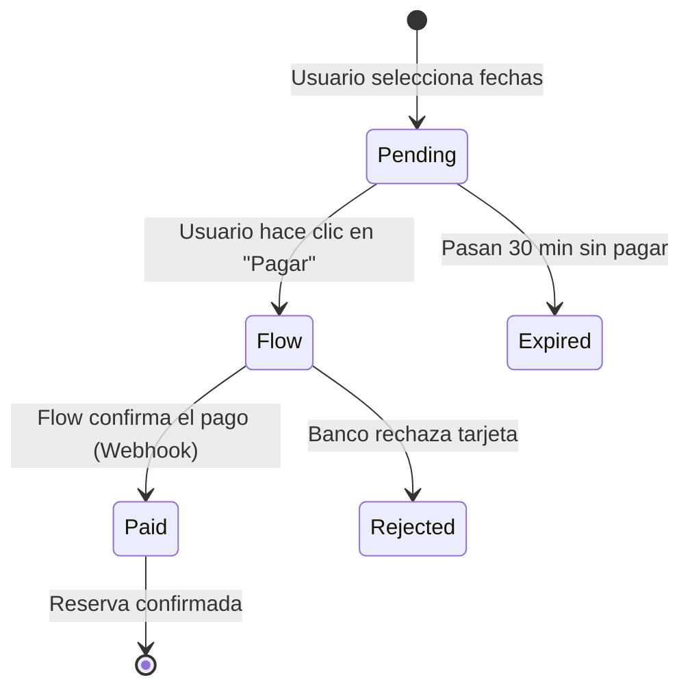

# Sistema de Reservas y Pagos (Flow)

Este documento explica cómo funciona el corazón del negocio: **Cómo una fecha en el calendario se convierte en dinero en el banco.**

---

## 1. El Flujo de Datos (The Big Picture)

Todo el proceso es una "Máquina de Estados". Una reserva pasa por varias etapas.



---

## 2. Paso 1: Creación de la Reserva (Pending)

Cuando el usuario selecciona fechas en el calendario (`AvailabilityCalendar.tsx`), el sistema crea una fila en la base de datos `bookings` con estado `pending`.

**¿Por qué `pending`?**
Porque bloqueamos las fechas temporalmente (hold) para que nadie más las gane mientras el usuario busca su tarjeta. Si no paga en 30 minutos, se libera.

---

## 3. Paso 2: Iniciar el Pago (El Puente a Flow)

El archivo clave es: `apps/web/app/api/payments/flow/create/route.ts`.

### ¿Qué hace este código?
1.  **Recibe** el ID de la reserva.
2.  **Verifica** que no haya expirado.
3.  **Firma** los datos. Flow exige seguridad. Usamos una "llave secreta" para firmar digitalmente el monto y el email. Si alguien intenta cambiar el monto en el camino, la firma no coincidirá y Flow rechazará el pago.
4.  **Llama a Flow** y obtiene una URL única de pago.

```typescript
// Ejemplo simplificado de lo que pasa en el servidor
const flowPayment = await flowClient.createPayment({
  commerceOrder: bookingId, // ID de nuestra reserva
  subject: 'Cabaña Bosque - 2 Noches',
  amount: 150000,
  email: 'cliente@gmail.com',
  urlConfirmation: 'https://misitio.com/api/payments/flow/webhook', // IMPORTANTE
  urlReturn: 'https://misitio.com/pago/confirmacion',
});

// Flow responde: { url: "https://flow.cl/p/...", token: "xyz" }
```

---

## 4. Paso 3: El Webhook (La Confirmación Real)

Aquí es donde muchos se confunden. **El navegador del usuario NO confirma el pago.** El usuario podría cerrar la ventana justo después de pagar.

Quien nos avisa es **Flow**, llamando a nuestro servidor directamente. Esto se llama **Webhook**.

Archivo: `apps/web/app/api/payments/flow/webhook/route.ts`

### Lógica de Seguridad (Crucial)
Cuando Flow nos llama, no le creemos ciegamente.
1.  Flow nos envía un `token` y una `firma`.
2.  Nosotros recalculamos la firma con nuestra llave secreta.
3.  Si coinciden, preguntamos a Flow: "¿Oye, este token está pagado?".
4.  Solo si Flow responde "SÍ, PAGADO", actualizamos la base de datos.

```typescript
// apps/web/app/api/payments/flow/webhook/route.ts

// 1. Validar firma (¿Es realmente Flow quien llama?)
if (!flowClient.validateWebhookSignature(params, signature)) {
  throw new Error("¡Alguien intenta hackearnos!");
}

// 2. Preguntar estado real
const status = await flowClient.getPaymentStatus(token);

// 3. Actualizar DB
if (status.status === 'PAID') {
  await supabase
    .from('bookings')
    .update({ status: 'paid' })
    .eq('id', bookingId);
    
  // 4. Enviar email
  await enviarEmailConfirmacion(bookingId);
}
```

---

## 5. El Cliente Flow (`packages/core/src/lib/flow/client.ts`)

Este archivo es una "Clase Utilitaria". Encapsula toda la complejidad de hablar con Flow.

**Funciones Clave:**
*   `sign(params)`: Crea la firma criptográfica (HMAC SHA256).
*   `createPayment(...)`: Inicia la transacción.
*   `getPaymentStatus(token)`: Consulta el estado final.

### ¿Cómo usarlo en otro lado?
Si quisieras cobrar otra cosa (ej: vender leña extra), es muy fácil:

```typescript
import { flowClient } from '@tresmorros/core/lib/flow';

const pago = await flowClient.createPayment({
  commerceOrder: 'venta-lena-123',
  subject: 'Saco de Leña',
  amount: 5000,
  email: user.email,
  // ... urls
});
```

---

## Resumen para el Programador

1.  **Frontend:** Solo inicia el proceso y redirige a la URL que le da el backend.
2.  **Backend (Create):** Valida reglas de negocio (fechas, stock) y genera la orden en Flow.
3.  **Backend (Webhook):** Es la **única fuente de verdad**. Si el webhook no corre, la reserva nunca se marca como pagada, aunque al usuario le hayan descontado la plata.
